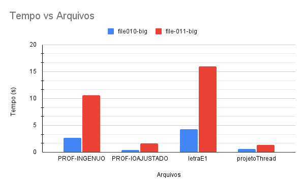
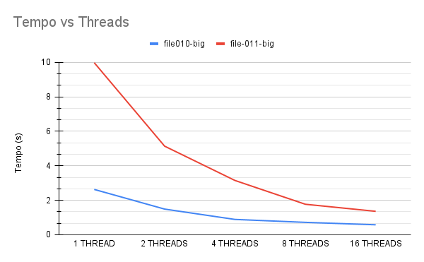

# Relatório

## Equipe

- Bruno Carmo Nunes - 18/0117548
- Gustavo Duarte Moreira - 20/0038141
- Marcos Vinícius Rodrigues da Conceição - 17/0150747	
- Mikhaelle de Carvalho Bueno - 15/0018673

## Partes paralelizadas e críticas

Na versão paralela foi utilizado a estratégia de paralelismo usando threads para realizar a leitura dos dados e computá-los.
O arquivo é carregado e cada thread fica responsável por computar uma parte dos dados do arquivo. Para dividir as partes entre as threads, utilizamos a abordagem de contar quantos bytes existem no arquivo, excluindo os bytes da primeira linha que corresponde ao número de senadores, deputados federais e deputados estaduais. Esse número de bytes é então dividido pelo número de threads, resultando na quantidade de bytes que aproximadamente cada thread será responsável por computar.

Para evitar a parada ou o começo no "meio" de uma linha, a thread lê até o "\n" e a próxima continua a execução até encontrar o "\n". Isso também evita a duplicação de dados.

A quantidade de votos por candidato por thread é armazenado em uma matrix [ i ] x[ j ] em que __i__ é o 
numero de linhas que corresponde a numeração das threads e o __j__ é o número de colunas que corresponde a 
numeração do candidato. O valor armazenado na posição __[ i ][ j ]__ corresponde ao número de votos válidos computados pela __thread i__ para o __candidato j__. Antes de armazenar o voto, é checado se ele é válido (votosValidos) ou inválido (votosInvalidos) e se é um voto para presidente (votosPresidente).

Depois esse resultado é armazenado em um vetor específico ao tipo do candidato, em que a posição corresponde ao numero do candidato. Esse vetor é então utilizado para todos os calculos subsequêntes.

Todos os calculos são feitos em paralelo o que demanda a utilização do __omp parallel reduction__.

A clausulá __reduction__ utiliza de redução nas variáveis que são passadas como parâmetros. Uma cópia privada das variáveis ​​são criadas para cada thread. O processo de redução é aplicada a todas as cópias privadas da variável e o resultado final é escrito na variável global.

A parte paralelizado do código é encontrado entre as linhas 81 e 166.

### Versão sequencial da equipe

    A versão sequencial da solução do problema utiliza vetores alocados dinamicamente, gerando um resultado não satisfatório na resolução do problema. Essa versão lê as entradas do arquivo por meio do *scanf* em um laço *while* que termina quando recebe a entrada *EOF*. 

### Comparação de desempenho entre as implementações

A comparação entre as implementações foram realizadas em todos os arquivos do BENCHMARK e neste relatório vamos evidenciar os dois maiores. Os testes foram utilizados na máquina chococino(gpu1).

| file010-big | PROF-INGENUO | PROF-IOAJUSTADO | CDMOJ | 1 THREAD | 2 THREADS | 4 THREADS | 8 THREADS | 16 THREADS |
| ----------- | ------------ | -------------- | ----- | -------- | --------- | --------- | --------- | ---------- |
| REAL        | 2,66         | 0,41           | 4,24  | 2,63     | 1,49      | 0,89      | 0,72      | 0,58       |
| USER        | 2,64         | 0,37           | 4,19  | 2,59     | 5,14      | 2,85      | 3,57      | 4,42       |
| SYS         | 0,01         | 0,03           | 0,03  | 0,02     | 0,03      | 0,03      | 0,02      | 0,1        |

*tempos em segundos

| file-011-big | PROF-INGENUO | PROF-IOAJUSTADO | CDMOJ | 1 THREADS | 2 THREADS | 4 THREADS | 8 THREADS | 16 THREADS |
| ------------ | ------------ | --------------- | ----- | --------- | --------- | --------- | --------- | ---------- |
| REAL         | 10,6         | 1,63            | 15,95 | 9,98      | 5,14      | 3,15      | 1,77      | 1,36       |
| USER         | 10,49        | 1,49            | 15,82 | 9,83      | 9,91      | 11,24     | 12,03     | 16,79      |
| SYS          | 0,1          | 0,13            | 0,12  | 0,16      | 0,18      | 0,16      | 0,12      | 0,17       |

*tempos em segundos

Abaixo segua a tabela do Tempo vs Arquivos:

Abaixo segua a tabela do Tempo vs Threads:

### Conclusão

Vimos que foi possível reduzir o tempo do processo quando utilizamos mais threads, no local do bloco onde ele abre o arquivo e busca as informações do mesmo (pragma omp). Ultrapassamos então o tempo definido pelo professor no file-011-big por 0,27 segundos. Porém no file010-big ficou com uma diferença de 0,17 segundos a favor do PROF-IOAJUSTADO.