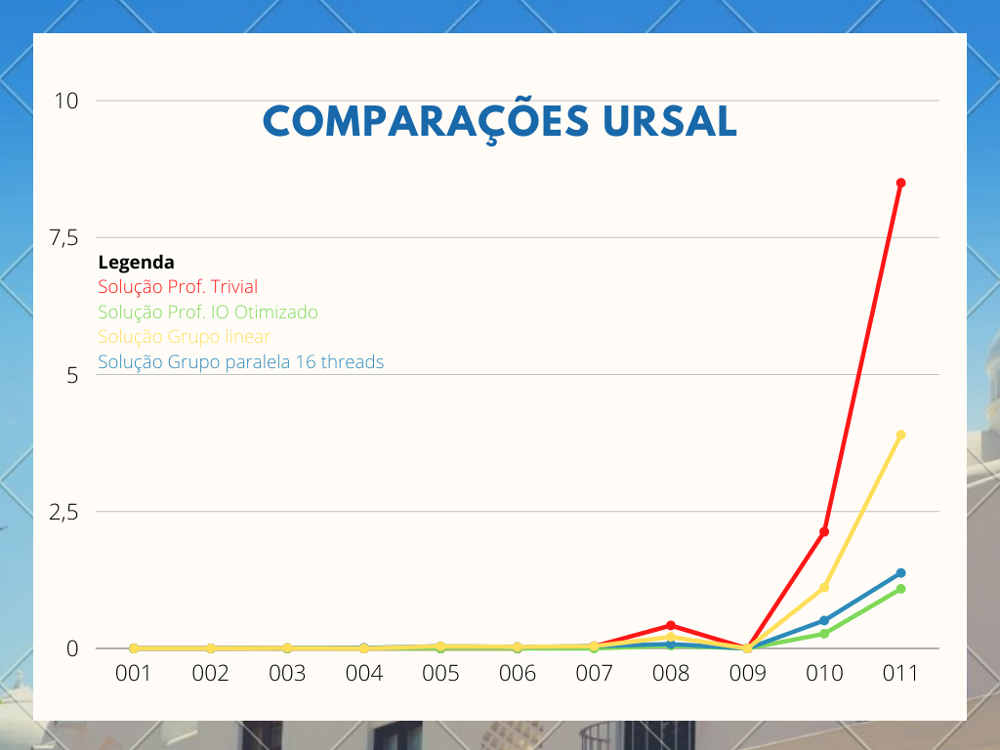

# Equipe Gabriel


## Integrantes:

- Gabriel Albino (160028361)

## Informações sobre as regiões críticas de paralelização

O programa possui apenas uma região crítica atômica do tipo update (default) definida como `#pragma omp atomic`, que ocorre apenas no incremento do numero de votos de um determinado candidato.

## Experimentos e tentativas da equipe

A equipe não teve exito de desenvolver a paralelização até a aula de alinhamento do dia 01/09, onde foi esclarecido o metodo de desenvolvimento e após isso foi desenvolvido a primeira versão do código, já adaptada para a entrada via arquivo e utilização de hashs, conforme orientado na aula.

Após isso o código foi paralelizado, sofrendo algumas modificações como:
* Tratamento para lidar com o inicio da contagem no meio de uma palavra:
```c
if (buffer[i - 1] != '\n') {
  continue;
}
```
* Tratamento de regiões críticas
```c
#pragma omp atomic
  votos[numPlaces(voto) - 2][voto]++;
```
* Criação da área paralela de leitura de votos, declarando variaveis privadas e compartilhadas.
```c
#pragma omp parallel for private(voto) shared(votosPresidente) shared(votosSenadores) shared(votosEstadual) shared(votosFederal)
  for (int i = aux; i < bytesRead; i++)
```
* Criações de reductions para calculo do total de votos
```c
#pragma omp parallel for reduction(+:votosInvalidos) reduction(+:votosValidos)
```
# Teste de desempenho

Para facilitar a análise dos dados, foram utilizadas as versões de controle do professor e a versão de 16 threads paralela. Os arquivos de saída encontram-se na pasta assets. O grafico abaixo demonstra que houve um prejuizo irrisório ao paralelizar em arquivos pequenos.
