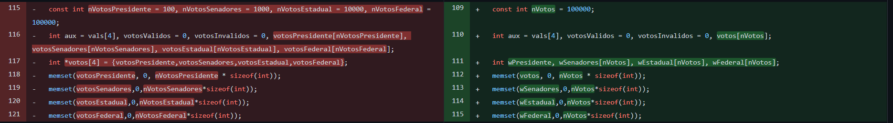
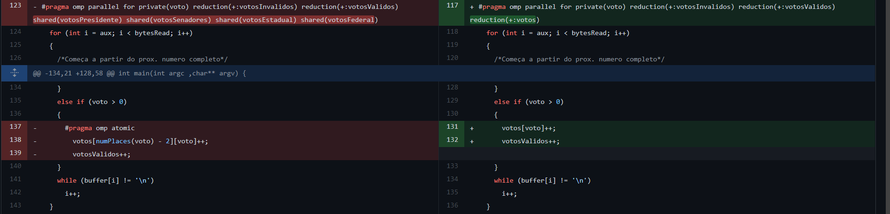
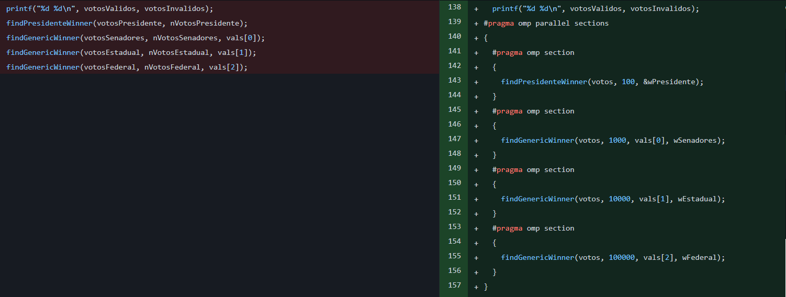
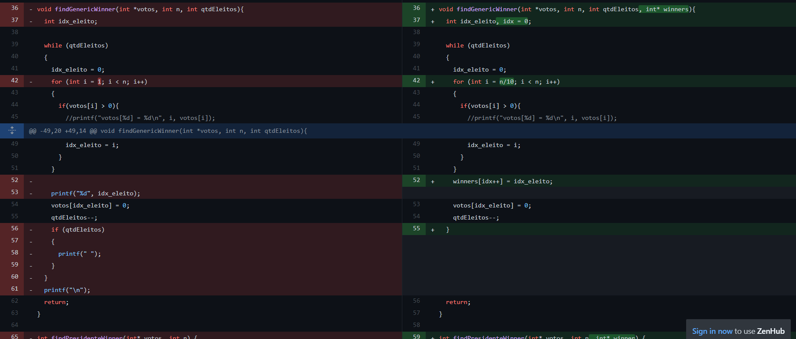
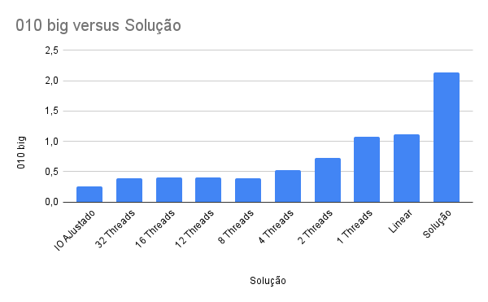
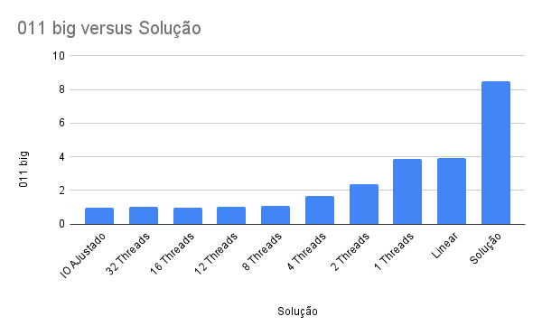
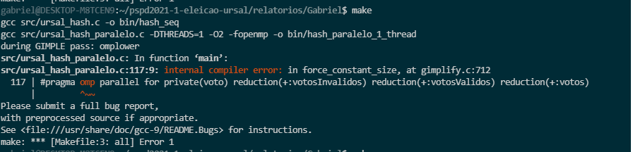

# Equipe Gabriel


## Integrantes:

- Gabriel Albino (160028361)

## Informações sobre as regiões críticas de paralelização

O programa possui apenas uma região crítica atômica do tipo update (default) definida como `#pragma omp atomic`, que ocorre apenas no incremento do numero de votos de um determinado candidato.

## Experimentos e tentativas da equipe

A equipe não teve exito de desenvolver a paralelização até a aula de alinhamento do dia 01/09, onde foi esclarecido o metodo de desenvolvimento e após isso foi desenvolvido a primeira versão do código, já adaptada para a entrada via arquivo e utilização de hashs, conforme orientado na aula.

Após isso o código foi paralelizado, sofrendo algumas modificações como:
* Tratamento para lidar com o inicio da contagem no meio de uma palavra:
```c
if (buffer[i - 1] != '\n') {
  continue;
}
```
* Tratamento de regiões críticas
```c
#pragma omp atomic
  votos[numPlaces(voto) - 2][voto]++;
```
* Criação da área paralela de leitura de votos, declarando variaveis privadas e compartilhadas.
```c
#pragma omp parallel for private(voto) shared(votosPresidente) shared(votosSenadores) shared(votosEstadual) shared(votosFederal)
  for (int i = aux; i < bytesRead; i++)
```
* Criações de reductions para calculo do total de votos
```c
#pragma omp parallel for reduction(+:votosInvalidos) reduction(+:votosValidos)
```

# Evoluções

## Armazenamento dos votos

Foi altearado o armazenamento para utilizar apenas um vetor ao inves de quatro, dado que a posição hash ocupada por cada candidato não é conflitante entre os tipos de candidatos. Isso possibilitou uma implementação mais fácil da leitura do arquivo.



## Leitura do arquivo

Na leitura do arquivo foi alterado para uma reduction para a some dos candidatos no vetor 'votos'. além de ter sido removida a diretiva "atomic".


## Contagem de votos

Na contagem de votos, foi alterado para utilizar sections para o calculo dos ganhadores de cada tipo de voto.



Para trabalhar corretamente com threads, tiveram que alterar a função de contagem para ao inves de printar direto quando encontra o valor, armazena-los em um vetor e o print ocorre apenas apos a verificação de todos os votos para que não ocorra conflito no print das threads.


# Teste de desempenho

Devido a dificuldades no acesso das maquinas disponibilizadas, os testes foram realizados os testes em um i7-10750H CPU @ 2.60GHz 2.59 GHz

|Solução|011 big|010 big|
|-|-|-|
|IO AJustado|0.99|0.26|
|16 Threads|0.93|0.38|
|12 Threads|0.99|0.37|
|8 Threads|0.94|0.35|
|4 Threads|0.94|0.36|
|2 Threads|0.93|0.36|
|1 Threads|1.98|0.38|
|Linear|3.90|1.11|
|Solução Ingenua|8.50|2.13|






# Compilando com -O3 / -O2
Não foi possível realizar a compilação com -O2 e -O3 devido a um erro

