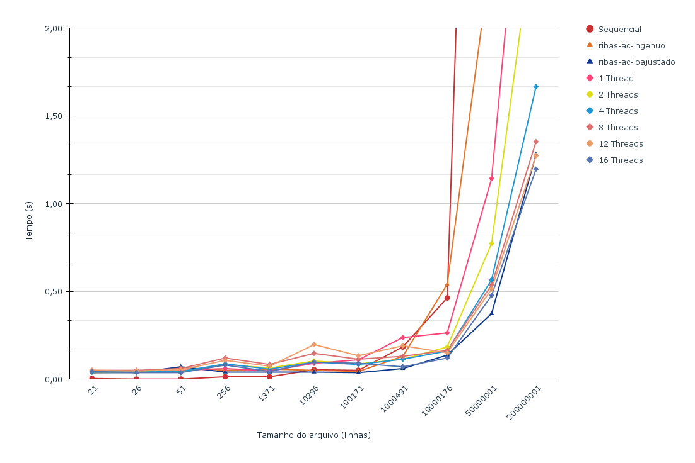

# Relatório

## Membros da Equipe

  * Gabriela Medeiros da Silva - 16/0121817
  * Geovana Ramos Sousa Silva - 16/0122180
  * Guilherme Guy de Andrade - 16/0123186


## Experimentos e tentativas da equipe

Após fazermos os algorítimos sequenciais (*ursal_array..c* e *ursal_lista.c*), desenvolvemos a primeira versão paralela (*ursal_paralelo.c*) onde foi utilizada a estratégia de paralelismo na leitura dos dados. O arquivo é carregado integralmente na memória e as threads se tornam responsáveis por diferentes áreas do arquivo. Isso é feito obtendo o tamanho total de *bytes* do arquivo e dividindo pela quantidade de *threads* considerando o espaço da primeira linha, que contém informações gerais.

Após uma análise mais apurada no código, evoluímos para a versão que se encontra no arquivo *ursal_paralelo_v2.c*. Foi notado um gargalo relevante no uso da  função *atoi*, responsável por converter uma *string* até um espaço ou *\n* em inteiro. Por esse motivo, foi decidido que usaríamos um algorítimo próprio que possui a mesma saída do *atoi* para esse contexto.

Ao invés disso:
```c
// ursal_paralelo.c

voto = atoi(&buffer[byte]); 
```

Usamos isso:
```c
// ursal_paralelo_v2.c

voto = 0;
while (buffer[byte] != '\n') { 
    voto = (voto*10) + (buffer[byte] - '0');
    byte++;
}
```

Essa substituição foi feita em todas as partes que usavam o *atoi* para leitura de números separados por espaços ou quebras de linhas.

Outra alteração relevante foi a remoção do *atomic* no momento de incrementar um voto ao candidato. Para isso, o array de votos foi adicionado na declaração do *parallel for* como variável de resultado da redução e a linha que continha a declaração de operação atômica foi removida.

A última alteração feita foi a paralelização do código no momento de eleger os candidatos. Para isso usamos as *sections* do openmp e separamos a chamada dos *printf()* para evitar o bloqueio das threads. Através das *sections* é possível separar blocos de códigos independentes que podem ser executados ao mesmo tempo. Veja a implementação no trecho de código abaixo:

```c
// ursal_paralelo_v2.c

#pragma omp parallel sections num_threads(THREADS)
{
    #pragma omp section 
    {
        elege_presidente(votos);
    }
    #pragma omp section 
    {
        elege_candidato(senadores_eleitos, max_senadores, votos, 100, 999);
    }
    #pragma omp section 
    {
        elege_candidato(federais_eleitos, max_federais, votos, 1000, 9999);
    }
    #pragma omp section 
    {
        elege_candidato(estaduais_eleitos, max_estaduais, votos, 10000, 99999);
    }
} 
```

### Leitura do arquivo

Quando uma *thread* inicia sua leitura, ela continua a ler até encontrar um marcador *\n* para indicar o fim de uma linha. Só após encontrar esse marcador a leitura é iniciada. Ou seja, caso a *thread* comece a leitura no meio de uma linha - e, consequentemente no meio de um número -  ela avança para a linha seguinte do arquivo e essa linha será responsabilidade da *thread* anterior. Como todas as *threads* repetem este comportamento, não há linha computada mais de uma vez ou linha não lida.

## Informações sobre as regiões críticas de paralelização

A região paralelizada que possui questões de concorrência é mostrada a seguir:

```c
// ursal_paralelo_v2.c

#pragma omp parallel for private(voto) reduction(+:total_geral) reduction(+:total_invalidos) reduction(+:votos)
for (int byte = byte_atual; byte < leitura; byte++) {
    if (buffer[byte - 1] != '\n') { 
        continue;
    }

    voto = 0;
    while (buffer[byte] != '\n') { 
        voto = (voto*10) + (buffer[byte] - '0');
        byte++;
    }
    
    if (voto < 0) {
        total_invalidos++;
    } else if (voto > 0) {
        votos[voto]++;
        total_geral++;
    }
}

```

Nesta região são utilizadas as diretivas do *OMP* da seguinte forma:

```c
#pragma omp parallel for private(voto) reduction(+:total_geral) reduction(+:total_invalidos) reduction(+:votos)
```
Esse trecho de código define uma região paralela que executará três reduções de soma, uma para o total de votos, outra para contabilizar os votos inválidos e outra para somar os votos de cada candidato. Além disso é definida a variável *voto* como privada para cada *thread* por seu valor ser definido dentro do *loop*.

É possível visualizar a alteração feita na última versão, explicada no tópico anterior. Nela podemos notar que a variável *votos* está dentro de *reduction()* e que não possui uma diretiva de operação atômica na linha anterior.

### Teste de desempenho

Os testes foram realizados no cluster *Chococino*, na máquina CM2. Cada um dos testes foi executado três vezes, para cada arquivo de entrada, sendo o tempo final a média do tempo de execução.

Para melhor leitura dos gráficos, foram gerados dois gráficos para cada solução à medida que foi evoluída, um com os arquivos de entrada que possuem até 1000491 linhas e outro para arquivos com mais de 1000491. 

Com o objetivo de mostrar a evolução das duas versões paralelizadas, primeiro veremos a primeira versão da solução:

#### Primeira versão paralelizada


Entradas com até 1000491 linhas        |  Mais que 1000491 linhas
:-------------------------------------:|:-------------------------:
               |  


#### Primeira versão paralelizada executada com O3


Entradas com até 1000491 linhas        |  Mais que 1000491 linhas
:-------------------------------------:|:-------------------------:
               |  

#### Segunda versão paralelizada executada com O3


Entradas com até 1000491 linhas        |  Mais que 1000491 linhas
:-------------------------------------:|:-------------------------:
               |  


[Fonte dos dados](https://docs.google.com/spreadsheets/d/e/2PACX-1vRq1nuJRUqMmV2D0_mPMxHVD7dH3h2R1TRSDPhrpmYdfp-eEjq3NbD8-Fwg7vyM2KGGf2RuwSysfSy7/pubhtml)

É possível notar que a versão sequencial é uma boa opção para arquivos com até 50 linhas, mas que se torna uma solução bem mais lenta a partir disso. Também podemos ver que, na melhor versão da solução, as execuções com entradas maiores e que utilizaram 4 e 8, assim como as  12 e 16 threads possuem tempos muito próximos, tendo que avaliar qual o impacto de ocupar tantas threads em um ambiente com maiores limitações de recursos.  

## Gerador de gráficos

Com o objetivo de automatizar a geração de dados que populam os gráficos foi feito um algorítimo em *Python* que pode ser visto a seguir:

```python
## run_benchmark.py

### SHOULD BE RUN FROM REPOSITORY ROOT FOLDER, NOT FROM 'reltorios' FOLDER
import subprocess
import queue


def run_benchmark(program):
    command = f"BENCHMARKBINARY={program}"

    _ = subprocess.run(["make", "clean"], stdout=subprocess.PIPE)
    result = subprocess.run(
        ["make", "-s", "benchmark", command],
        stdout=subprocess.PIPE,
        stderr=subprocess.PIPE,
    )

    progman_order = result.stdout.decode("utf-8").split("\n")

    run_times = result.stderr.decode("utf-8").split("\n")
    run_times_queue = queue.Queue()
    for o in run_times:
        run_times_queue.put(o)

    ret = {}
    last_key = ""
    progman_order.pop()
    for prog in progman_order:

        if prog == "":

            data = {
                "real": float(run_times_queue.get().split(" ")[1]),
                "user": float(run_times_queue.get().split(" ")[1]),
                "sys": float(run_times_queue.get().split(" ")[1]),
            }

            ret[last_key] = data
        else:
            last_key = prog.split("/")[-1]

    return ret


def print_result(prog, data):

    print(f"\n{prog}")

    files = {}
    shows = {}
    for run in data:
        for f, val in run.items():
            if f not in files:
                files[f] = []

            files[f].append(val)

    for f, runs in files.items():
        show_str = [f'{d["real"]}, {d["user"]}, {d["sys"]}' for d in runs]
        show_str = ", ".join(show_str)
        shows[f] = f"\t{' ' * (16 - len(f))}{f}: {show_str}"

    order = [
        "file001-sample",
        "file009",
        "file002-sample",
        "file003",
        "file004",
        "file005-sample",
        "file006",
        "file007-sample",
        "file008",
        "file010-big",
        "file-011-big",
    ]

    for f in order:
        print(shows[f])


def main():

    BASE_PATH = "relatorios/Gabriela-Geovana-Guilherme/build/"
    programs = [
        "paralelo_1",
        "paralelo_2",
        "paralelo_4",
        "paralelo_8",
        "paralelo_12",
        "paralelo_16",
        # "sequencial",
    ]

    benchmark_results = {}

    for p in programs:

        benchmark_results[p] = []

        for i in range(0, 4):
            print(f"Running {p} #{i + 1}...")
            result = run_benchmark(f"{BASE_PATH}{p}")

            if i == 0:
                continue  # discard first run

            benchmark_results[p].append(result)

    for p in programs:
        print_result(p, benchmark_results[p])


if __name__ == "__main__":
    main()

```


<!-- A seguinte tabela compara o tempo médio das soluções de acordo com a entrada:


> O resultado com menor tempo para cada arquivo está em destaque com **negrito** e o pior resultado em *itálico*.

Para entradas pequenas (0 até 1371 linhas), a versão sequencial sempre obteve o melhor resultado. Ganhando, inclusive, da versão de 1 *Thread*. Isso se deve ao *overhead* que as *threads* acrescentam ao código.

Entretanto, para entradas maiores a versão sequencial começa a mostrar suas limitações e para entradas maiores que 50000001 linhas ela é a mais demorada por uma grande margem.

* Gráficos com os tempos das diversas soluções



> [Versão interativa](https://docs.google.com/spreadsheets/d/e/2PACX-1vRq1nuJRUqMmV2D0_mPMxHVD7dH3h2R1TRSDPhrpmYdfp-eEjq3NbD8-Fwg7vyM2KGGf2RuwSysfSy7/pubchart?oid=1733279557&format=interactive) -->
