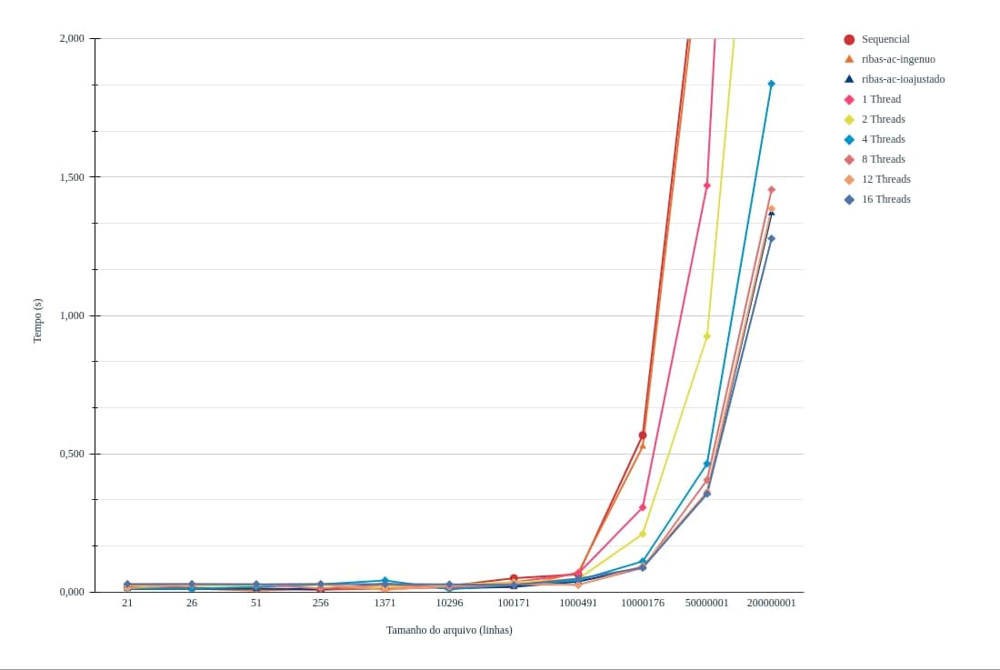

# Relatório

## Membros
|Matrícula | Aluno |
| -- | -- |
| 15/0009011 |  Elias Bernardo Marques Magalhães |
| 15/0135521 |  Leonardo dos S. S. Barreiros |

## Informações

<p align="justify">
Deve ser levado em consideração que as threads são capturadas no momento em que o usuário insere o comando no terminal para rodar o programa.

``` sh
$ gcc -fopenmp main.c -o <arquivo-de-saida>
```

E para rodar executaremos:

``` sh
$ ./out <arquivo-de-input> <quantidade-de-threads>
```

Por exemplo:

``` sh
$ ./out input/file009 4
```
<p align="justify">
Desta forma estamos especificando que serão utilizadas 4 threads para estar realizando as instruções do arquivo main.

## Informações sobre as regiões críticas de paralelização

<p align="justify">
Para o script sequencial foi definido uma struct de candidato em que cada canditado tem um index e quantidade de votos e também é definido um array estático com esta struct, no qual após o processamento é computado todos os candidatos e suas quantidades de votos além de ser feito a ordenação dos mesmo. obtemos uma boa média de resultados próximos aos que foram apresentados no banchmark para ribas-ac-ingenuo, mas relacionado ao ribas-ac-ioajustado a diferença é considerável.
Os resultados estão presentes na seção seguinte.

<p align="justify">
Portanto para estar diminuindo este valor considerável em relação ao ribas-ac-ioajustado realizamos o processo de paralelização do script. Que a principais mudanças que foram feitas está relacionado a leitura e contagem dos votos.

<p align="justify">
A cerca das regiões críticas precisamos fazer uma paralelização privada para a variável voto, que está relacionado a cada linha lida do arquivo, portanto, cada thread irá abrir o arquivo ler até encontrar o marcador <strong>\n</strong>, de forma em que essa leitura e feita por blocos e cada um desses blocos é definido de acordo com a quantidade de threads. Em seguida é definido o limite de cada bloco para cada thread que é determinado como sendo o inicio da thread seguinte ou o final do arquivo para o caso de ser o bloco final de leitura.

<p align="justify">
É realizado o loop para ser lido e contabilizado cada voto por thread diferenciando entre voto válido e inválido.

<p align="justify">
E para contabilizar os votos dos candidatos foi utilizado a diretiva atomic a fim de uma thread não sobrescrever a execução de outra no momento em que for incrementar a variável <strong>candidatos[voto].votos++</strong>.

Ao final cada thread realiza o fechamento do arquivo.


```c
    #pragma omp parallel private(voto) num_threads(num_threads) reduction(+:votosValidos, invalidos)
    {
        char *line = NULL;
        line = malloc(sizeof(char)*6);

        FILE *fptr;

        size_t len = sizeof(int);

        fptr = fopen(argv[1],"r");

        fseek(fptr, limits_per_thread[omp_get_thread_num()].start_limit, SEEK_SET);

        char ch;
        do {
            fscanf(fptr, "%c", &ch);
        } while(ch != '\n');

        int end_limit = (num_threads - 1) == omp_get_thread_num()
                ? total_file_size
                : limits_per_thread[omp_get_thread_num() + 1].start_limit;

        for (int i = ftell(fptr); i < end_limit;)
        {   
            i += getline(&line, &len, fptr);
            voto = atoi(line);
        
            if (voto > 0) {
                votosValidos++;

                #pragma omp atomic
                candidatos[voto].votos++;
            }
            else {
                invalidos++;
            }

        }
        free(line);
        fclose(fptr);
    }
```

## Teste de desempenho

Inputs | qtd. linhas | sequencial | ribas-ac-ingenuo | ribas-ac-ioajustado | paralelo 1 thread | paralelo 2 thread | paralelo 4 thread | paralelo 8 thread | paralelo 12 thread | paralelo 16 thread |
| -- | -- | -- | -- | -- | -- | -- | -- | -- | -- | -- |
| file001-sample    | 21            | 0,021 | 0,012 | 0,011 | 0,024 | 0,023 | 0,012 | 0,028 | 0,014 | 0,029 |
| file009           | 26            | 0,015 | 0,012 | 0,011 | 0,024 | 0,024 | 0,012 | 0,028 | 0,027 | 0,029 |
| file002-sample    | 51            | 0,012 | 0,005 | 0,012 | 0,023 | 0,024 | 0,018 | 0,028 | 0,027 | 0,028 |
| file003           | 256           | 0,008 | 0,012 | 0,010 | 0,026 | 0,024 | 0,028 | 0,012 | 0,029 | 0,029 |
| file004           | 1371          | 0,013 | 0,012 | 0,030 | 0,009 | 0,017 | 0,042 | 0,026 | 0,007 | 0,029 |
| file005-sample    | 10296         | 0,022 | 0,016 | 0,013 | 0,021 | 0,026 | 0,010 | 0,017 | 0,023 | 0,028 |
| file006           | 100171        | 0,050 | 0,017 | 0,019 | 0,035 | 0,035 | 0,025 | 0,027 | 0,032 | 0,025 |
| file007-sample    | 1000491       | 0,064 | 0,071 | 0,038 | 0,067 | 0,047 | 0,042 | 0,026 | 0,025 | 0,048 |
| file008           | 10000176      | 0,567 | 0,526 | 0,088 | 0,306 | 0,210 | 0,111 | 0,087 | 0,094 | 0,088 |
| file010-big       | 50000001      | 2,605 | 2,522 | 0,358 | 1,470 | 0,925 | 0,464 | 0,405 | 0,362 | 0,355 |
| file-011-big      | 200000001     | 10,373 | 10,019 | 1,370 | 5,763 | 3,496 | 1,838 | 1,455 | 1,386 | 1,278 |

<p align="justify">
Foi observado que foi obtido uma aproximação do valor do ribas-ac-ioajustado a partir de 8 threads e de fato sendo superior a partir de 16 threads. Também podemos observar que para entradas pequenas o script de versão paralela prejudica a eficiencia do algoritmo.

## Gráfico demonstrativo

