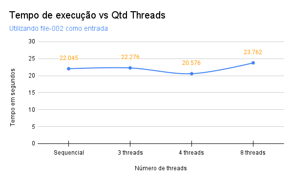
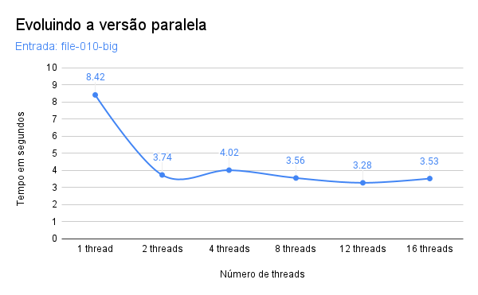
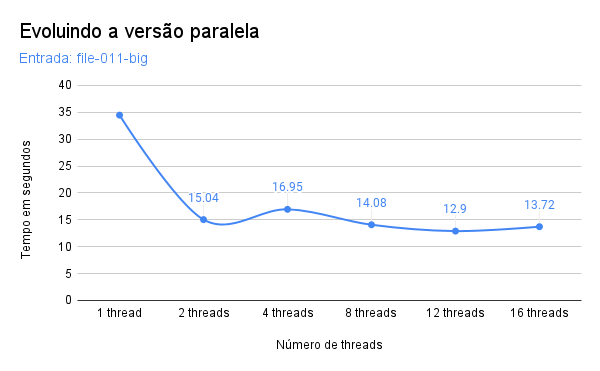
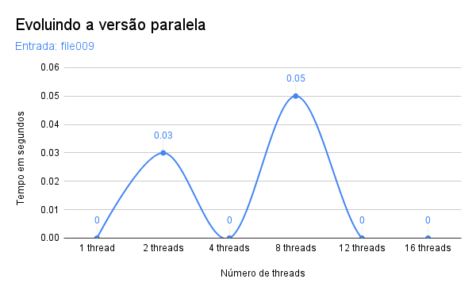
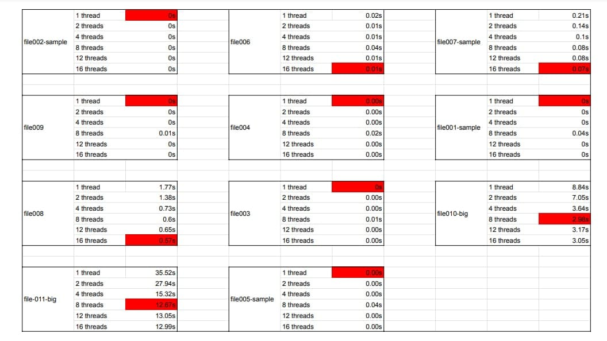

# Equipe Sara-Erick-Ailton-Maicon

Integrantes:

- Ailton Aires (180011600)
- Erick Giffoni (170141161)
- Maicon Mares (180023411)
- Sara Silva (160144752)

# O trabalho: Eleição U.R.S.A.L

Este trabalho tem como objetivo a aplicação da programação paralela para resolver 
o problema "Eleição U.R.S.A.L", utilizando a API "OpenMP". 

O contexto do trabalho envolve os estudos sobre programação em paralelo desenvol- 
vidos na disciplina "Programação para Sistemas Paralelos e Distribuídos", no pe- 
ríodo 2021/1 da Universidade de Brasília, Faculdade do Gama. 

# Desenvolvimento

## Primeiras versões

No começo desse trabalho, nossa equipe desenvolveu uma solução sequencial e outra 
paralela para o problema proposto. Isso foi antes da criação do repositório oficial 
para o trabalho pelo professor Bruno Ribas. 

Nesse sentido, utilizamos alguns scripts em `bash`, de nossa autoria, para executar 
nossas soluções e gerar resultados, conforme a organização abaixo. Nesse momento, 
os arquivos de entrada utilizados foram `file-001` e `file-002`, disponibilizados 
na página web oficial do professor Ribas [1].

- [`teste-sequencial.sh`](./teste-sequencial.sh): script para executar testes com a solução sequencial; 
- [`teste-paralelo.sh`](./teste-paralelo.sh): script para executar testes com a solução paralela; 
- [`benchmark-solucoes.txt`](./benchmark-solucoes.txt): resultados obtidos a partir da utilização dos nos- 
sos scripts. 

**Sobre o desempenho dessas primeiras versões:**

Especificações do computador que executou os testes nesse momento: 

- MacOS 2.6 GHz Quad-Core Intel Core i7, 16 GB 2133 MHz LPDDR3

Sendo assim, a figura 1 abaixo compara os tempos de execução das nossas soluções 
sequencial e paralela. Os valores foram obtidos por meio da execução dos scripts 
de teste explicados acima. 

Figura 1: 

 Fonte: autores
</img> 

Conforme evidenciado no gráfico acima, os tempos de execução ficaram em torno de 
6 segundos, considerando o arquivo `file-001` como entrada. Ainda, nesse caso 
percebe-se que aumentar a quantidade de threads não gerou mudança significativa. 

De modo semelhante, a figura 2 abaixo mostra os tempos de execução das nossas so- 
luções sequencial e paralela, porém considerando o `file-002` como entrada. 

Figura 2: 

 Fonte: autores
</img> 

No caso do gráfico acima, deve-se levar em conta que `file-002` é bem maior que 
`file-001`. Por causa disso os tempos de execução aumentaram em relação ao primeiro 
gráfico. Mais ainda, percebe-se que a solução mais rápida é aquela que utilizou 4 
threads, enquanto a de 8 threads teve desempenho pior que a sequencial. 

**Sobre os códigos dessas primeiras versões:**

Ambas versões sequencial e paralela utilizavam vetores de tamanhos pré-definidos 
para computar os votos direcionados a cada político. Mais ainda, esses códigos 
utilizavam uma estratégia parecida com o algoritmo do *selection sort* para calcu- 
lar, para cada político, quem havia sido eleito. Vale lembrar que, dado o momento 
inicial do trabalho, ambas versões recebiam as entradas via `stdin` e, no caso 
da paralela, ainda não realizávamos a leitura da entrada de forma paralela. 

A diferença entre a solução sequencial e a paralela, então, é que a segunda 
utilizava a diretiva ***omp parallel sections*** para dividir o trabalho de calcu- 
lar os resultados da eleição de cada tipo de político entre as threads. Conforme 
evidenciado nos gráficos acima, essa estratégia teve desempenho baixo, principal- 
mente com o arquivo `file-002` como entrada. 

## Evoluindo a solução paralela

Nesse momento do trabalho, já estávamos com o repositório oficial para o trabalho 
em mãos. Fizemos um *fork* dele e passamos a trabalhar com a criação de diferentes 
*branches* para cada objetivo que queríamos alcançar. 

**Sobre o código paralelo:**

A turma logo recebeu algumas orientações do professor Ribas com o intuito de que 
todos entendessem quais seriam os próximos desafios do trabalho. Dentre eles, co- 
meçamos a trabalhar para que a leitura dos votos de entrada do programa fosse feita 
de forma paralela. 

Para isso, ao invés do codigo ler a partir da entrada padrão (*stdin*), ele foi 
evoluído para ler um arquivo que tivesse os valores de entrada. Tal arquivo po- 
de conter várias linhas, sendo que cada uma pode ter um número diferente de bytes. 
Nossa equipe decidiu usar uma estratégia que contasse quantos bytes o arquivo tinha, 
no total, dividisse essa quantidade de modo igual para cada *thread* e fizesse o 
controle desses processos paralelos para que cada um lesse a quantidade de bytes 
dividida anteriormente, sem que deixar que uma *thread* "invadisse" o espaço da 
outra ou que algum valor de entrada fosse perdido ou repetido. 

Para que a estratégia da leitura paralela fosse realizada com sucesso, tivemos que 
utilizar algumas funções que nos ajudassem na manipulação de arquivos. Algumas delas 
são: `fseek`, `fscanf`, `ftell`, `fopen` e `fclose`.

Mantivemos a utilização daqueles vetores estáticos para computar cada voto, sendo 
que existe a possibilidade de uma ou mais *threads* acessarem uma mesma posição 
"ao mesmo tempo". Considerando que, antes da leitura ser iniciada, os vetores são 
preenchidos de zeros, e que a computação do voto apenas incrementa em 1 determi- 
nada posição do vetor em questão, não há problema se *threads* acessarem aquele 
local "ao mesmo tempo". 

**Observando o desempenho nesse ponto do trabalho:**

Especificações do computador que executou os testes nesse momento: 

- Ubuntu 20.04 LTS, 11th Gen Intel® Core™ i5-1135G7 @ 2.40GHz × 8

Realizamos os testes para essa versão paralela evoluída e utilizamos uma planilha [2] 
para avaliar os resultados e montar gráficos. Além disso, os resultados para essa 
ocasião também estão disponíveis em [`resultados.txt`](./resultados.txt). 

A seguir mostramos alguns gráficos comparando a quantidade de *threads* e os tem- 
pos de execução. Para que o relatório não ficasse muito extenso, decidimos colocar 
aqui apenas 3 dos 11 possíveis gráficos. 

Sendo assim, a figura 3 a seguir é relativa ao arquivo de entrada `file010-big`. 

Figura 3: 

 Fonte: autores
</img> 

É possível notar que, nesse caso, aumentar o número de *threads* diminuiu bastante 
o tempo de execução. Mesmo assim, utilizar 12 *threads* foi melhor que usar 16. 

De modo semelhante, a figura 4 abaixo é relativa ao arquivo de entrada `file-011-big`. 

Figura 4: 

 Fonte: autores
</img> 

Sobre esse gráfico, também percebe-se a diminuição do tempo de execução conforme 
o número de *threds* aumenta. Semelhantemente ao gráfico 3, utilizar 12 *threads* 
foi melhor que usar 16. 

Já a figura 5 a seguir é relativa ao arquivo de entrada `file009`. 

Figura 5: 

 Fonte: autores
</img> 

Ocorreu um fato curioso, dado que esse arquivo de entrada é menor que os utiliza- 
dos para gerar as figuras 3 e 4. Percebe-se que aumentar o número de *threds* piora 
bastante o desempenho da solução. 

## Histograma

O código foi evoluído usando a lógica de histograma, que consiste em uma distribuição de frequências. Foi usado um vetor *votos* e a cada voto *v* válido lido, o valor do vetor no índice *v* é incrementado, registrando assim a frenquência desse voto. Então deixaram de ser usados os vetores diferentes para cada tipo de candidato.
Nessa versão também foi utilizada a diretiva do for do OpenMp para paralelizar o laço principal de leitura dos votos.

**Observando o desempenho nesse ponto do trabalho:**

Especificações do computador que executou os testes nesse momento: 

- Ubuntu 20.04 LTS, 11th Gen Intel® Core™ i5-1135G7 @ 2.40GHz × 8

A tabela a seguir apresenta os resultados para melhor solução implementada considerando todos os arquivos de entrada. 
Tabela 1: 

 Fonte: autores
</img> 

Praticamente todos os tempos de execução ficaram próximos a 0 (zero) segundo, 
o que é muito bom. As 2 únicas exceções são para os arquivos `file010-big`, cujo 
melhor tempo foi **2.98 segundos** com 8 *threads*, e `file-011-big`, cujo melhor tem- 
po foi 12.67 segundos com 8 *threads*. 

## Referências

[1] RIBAS, Bruno. Aula 18 de Agosto. Disponível em: https://www.brunoribas.com.br/pspd/2021-1/#orga81c164

[2] Autores. Planilha de resultados diversos. Disponível em: https://docs.google.com/spreadsheets/d/1B6N221LsnoZr-mcAZc0cFOv39i3_os2w_r7ys_ToiIs/edit?usp=sharing
