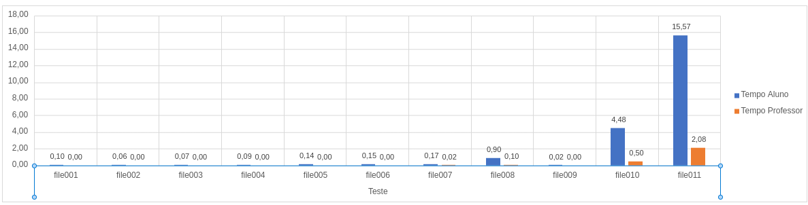

# Relatório

## Membro da Equipe

  * Victor Levi Peixoto - 17/0115208

## Experimentos e tentativas do aluno

Foi experimentado pelo aluno primeiramente paralelizar somente as seleções dos candidatos, sendo eles armazenados em um hash único, tendo em vista que para o problema seria algo aceitável e que reduziria a quantidade de memória.

Após a primeira versão paralela foi adicionado ao código uma paralelização do **insertion sort**, mas não foi possível continuar com o mesmo, após isso a utilização do  **merge sort** foi tida como uma boa opção para a paralelização, mas não foi possível implementar a mesma, mesmo sendo uma alternativa simples.

Após as tentativas de paralelização dos sorts, foi alterado o foco para a paralelização da entrada, tendo em vista que o scanf é uma função *thread safe* e impede a leitura paralela do arquivo. Para essa solução o arquivo é aberto e o cursor do mesmo é movido para o fim tendo como finalidade encontrar o tamanho do arquivo por completo, após isso a leitura é paralelizada entre todas as threads disponíveis.

## Pontos a serem melhorados no trabalho

O trabalho precisa de melhoras na parte de ordenação do hash, uma possível alteração na estrutura de dados pode ser necessária para a conclusão de tal processo.

Ademais, existe uma possibilidade da leitura do arquivo não estar na forma mais otimizada.

### Teste de desempenho

Os testes foram realizados no cluster *Chococino*, na máquina CM2. Cada um dos testes foi executado três vezes, para cada arquivo de entrada, sendo o tempo final a média do tempo de execução.

A seguinte tabela compara o tempo médio das soluções de acordo com a entrada:

| Entrada        | Sequencial | ribas-ac-ingenuo | ribas-ac-ajustado | 1 Thread | 2 Threads | 4 Threads | 8 Threads | 12 Threads | 16 Threads |
| -------------- | ---------- | ---------------- | ----------------- | -------- | --------- | --------- | --------- | ---------- | ---------- |
| file001-sample | 0,04       | 0,03             | 0,00              | 0,11     | 0,08      | 0,14      | 0,06      | 0,06       | 0,06       |
| file009        | 0,04       | 0,00             | 0,00              | 0,11     | 0,09      | 0,13      | 0,07      | 0,06       | 0,07       |
| file002-sample | 0,05       | 0,00             | 0,00              | 0,11     | 0,10      | 0,12      | 0,06      | 0,06       | 0,06       |
| file003        | 0,16       | 0,00             | 0,00              | 0,12     | 0,11      | 0,19      | 0,07      | 0,08       | 0,08       |
| file004        | 0,15       | 0,00             | 0,00              | 0,12     | 0,20      | 0,11      | 0,07      | 0,07       | 0,08       |
| file005-sample | 0,65       | 0,00             | 0,00              | 0,17     | 0,15      | 0,19      | 0,12      | 0,15       | 0,13       |
| file006        | 0,05       | 0,01             | 0,00              | 0,18     | 0,21      | 0,18      | 0,11      | 0,25       | 0,13       |
| file007-sample | 0,12       | 0,11             | 0,01              | 0,25     | 0,20      | 0,26      | 0,17      | 0,23       | 0,16       |
| file008        | 0,89       | 0,76             | 0,13              | 1,10     | 1,07      | 0,83      | 0,76      | 0,74       | 0,83       |
| file010-big    | 4,50       | 3,83             | 0,50              | 4,98     | 5,09      | 4,00      | 3,58      | 3,38       | 3,32       |
| file-011-big   | 19,67      | 14,99            | 1,98              | 18,69    | 19,13     | 14,40     | 13,20     | 12,67      | 12,26      |

### Gráfico

Visando uma melhor vista do gráfico foram apresentadas somente a versão do aluno com 16 threads e a versão melhorada do professor

