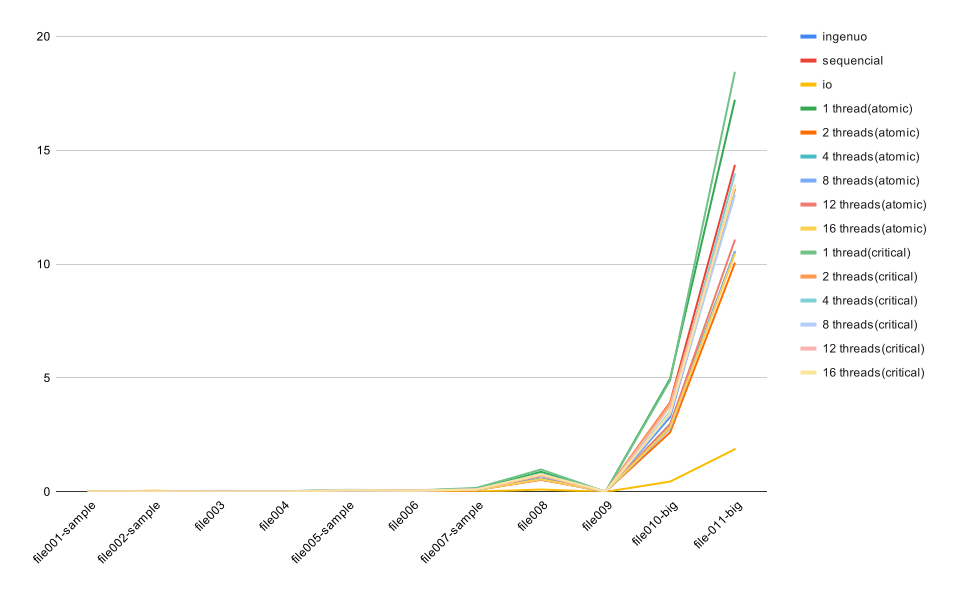

# Relatório

## Membros da equipe

| Nome                  | Matrícula |
| --------------------- | --------- |
| Ana Carolina Carvalho | 190063441 |
| Danillo Gonçalves     | 170139981 |
| Ésio Freitas          | 170033066 |
| Pedro Féo             | 170020461 |

## Introdução

O objetivo do trabalho é utilizar paralelização utilizando o OpenMP pra melhorar o desempenho do código fornecido pelo enunciado. Para realizar o trabalho foi necessário estudar e analisar as regiões críticas de memória.

## Sequencial

Esse foi o ponto de partida do nosso relatório, um código sequencial simples.

## Leitura

A sessão do código responsável pela leitua do arquivo de votos se mostrou a parte do código que mais consumia tempo. Por isso focamos em mehorar o desempenho dessa sessão em específico. O melhor resultado que conseguimos chegar foi através da divisão do arquivo em pedaços, assim cada uma das threads fica responsável por ler um pedaço do arquivo, armazenando o resultado em arrays e contadores.

É importante notar que existem algumas regiões críticas nesse processo de leitura, sendo eles no momento de escrita dos arrays e no incremento dos contadores de votos. Como todas as threads compartilham essa região de memória e estão constantemente tentando inserir novos valores, pode ser que haja uma sobrescrita nas variáveis.
Para impedir isso utilizamos dois metodos, para os contadores de votos utilizamos uma reduction, assim protegendo o acesso às variáveis __validVote__, __invalidVote__ e __totalVotesPresident__.
O segundo método foi utilizado para a escrita nos arrays __president__, __senator__, __congressman__ e __congressperson__, foi utilizado o método __atomic__ para realizar essa escrita.

## Seleção de Candidatos

Houveram alguns testes tentando paralelizar a parte de seleção dos candidatos, que pode ser encontrada na função printElected. Porém nenhuma das tentativas de paralelização mostrou resultados significantes no desempenho final do código.

### Testes realizados

#### Especificações da máquina de teste
- Testado na Chococino

Na tabela abaixo é possível ver o tempo em segundos obtidos em cada um dos testes.a
os testes ingenuo e io foram fornecidos pelo professor com o objetivo de comparar com nossos resultados.

|file          |ingenuo|sequencial|io  |1 thread(atomic)|2 threads(atomic)|4 threads(atomic)|8 threads(atomic)|12 threads(atomic)|16 threads(atomic)|
|--------------|-------|----------|----|----------------|-----------------|-----------------|-----------------|------------------|------------------|
|file001-sample|0      |0         |0   |0               |0                |0                |0                |0                 |0                 |
|file002-sample|0,1    |0,01      |0,01|0               |0,01             |0,01             |0,01             |0,02              |0,01              |
|file003       |0      |0         |0   |0               |0                |0                |0                |0,02              |0                 |
|file004       |0      |0         |0   |0               |0,01             |0                |0                |0,01              |0                 |
|file005-sample|0      |0,03      |0   |0,01            |0,01             |0,02             |0,06             |0,03              |0,01              |
|file006       |0,01   |0,02      |0   |0,01            |0,01             |0,01             |0,02             |0,02              |0,01              |
|file007-sample|0,05   |0,06      |0,01|0,03            |0,04             |0,04             |0,03             |0,02              |0,02              |
|file008       |0,48   |0,5       |0,11|0,6             |0,34             |0,2              |0,19             |0,15              |0,15              |
|file009       |0      |0         |0   |0               |0                |0                |0,01             |0,01              |0                 |
|file010-big   |2,38   |2,48      |0,34|2,99            |1,67             |0,92             |0,73             |0,71              |0,68              |
|file-011-big  |9,35   |9,56      |1,26|11,81           |6,52             |3,56             |2,79             |2,69              |2,5               |




### Regiões Críticas

O código paralelo possui sua região crítica localizada durante a leitura do arquivo.

```
#pragma omp parallel reduction(+ : validVote, invalidVote, totalVotesPresident)
  {
    FILE *file = fopen(argv[1], "r");
    long int start, end;

    start = thread_starts[omp_get_thread_num()];
    end = thread_starts[omp_get_thread_num() + 1];

    fseek(file, start, SEEK_SET);

    int size, vote;

    long int counter = start;

    while (fscanf(file, "%d%n", &vote, &size) != EOF) {
      counter += size;
      if (counter >= end) {
        break;
      }
      if (vote >= MIN_P) {
        validVote++;
        if (vote < MAX_P) {
          totalVotesPresident++;
#pragma omp atomic
          president[vote]++;
        } else if (vote < MAX_S) {
#pragma omp atomic
          senator[vote]++;
        } else if (vote < MAX_CM) {
#pragma omp atomic
          congressman[vote]++;
        } else {
#pragma omp atomic
          congressperson[vote]++;
        }
      } else
        invalidVote++;
    }
  }
```

Cada __atomic__ utilizado representa uma região dentro de um array de inteiros que deve ser acessado por somente uma thread por vez. Ao retirar o __atomic__ do código o programa executava normalmente, porém apresentava algumas inconsistências em relação aos valores do gabarito.

Optamos por utilizar __atomic__ ao invés de __critical__, pois percebemos após a realização de teste que a performance havia caido bastante, em alguns casos, tendo um desempenho até pior que a solução sequencial que desenvolvemos.

## Conclusão

Na realização da atividade percebemos que a parte mais custosa do código se encontrava na leitura do arquivo de input. Apesar de termos conseguido alcançar uma boa melhora nessa parte, poderia ser realizado um trabalho de paralelização que não utilizasse __atomic__ ou __critical__ para as regiões críticas de memória, tendo em vista que ao utilizar esses métodos precisamos realizar uma parada da execução das threads. Além disso também gostariamos de realizar uma paralelização efetiva da parte de seleção de candidatos, visto que nenhuma das tentativas realizadas mostrou resultado significativo no desempenho.

Percebemos também que a utilização de mais threads não necessariamente acarreta num maior desempenho do programa, nos resultados obtidos conseguimos observar que a partir de um determinado número de threads os resultados começam a se estagnar ou até piorar quando comparado com o teste anterior.
