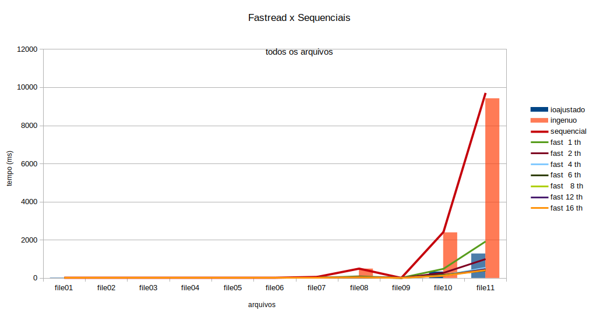
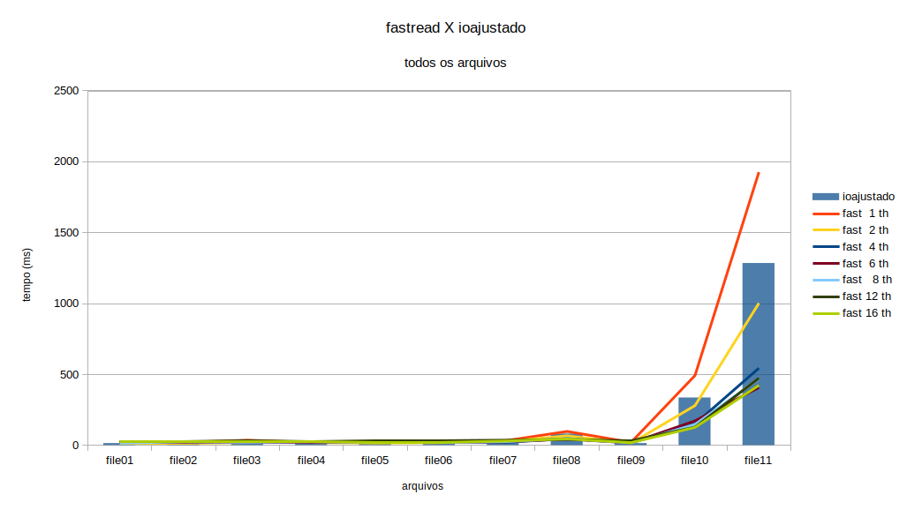
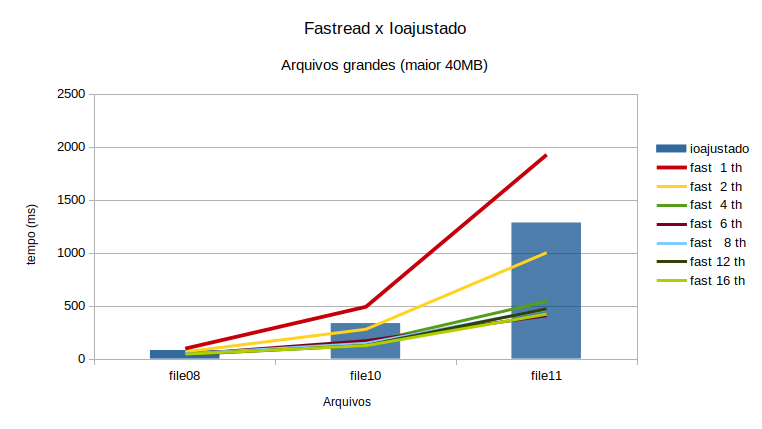
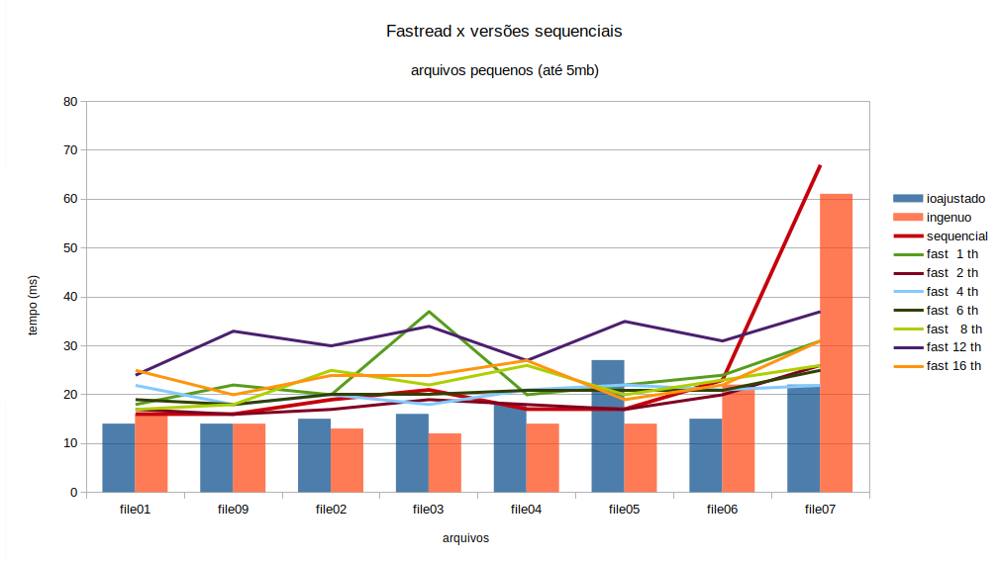
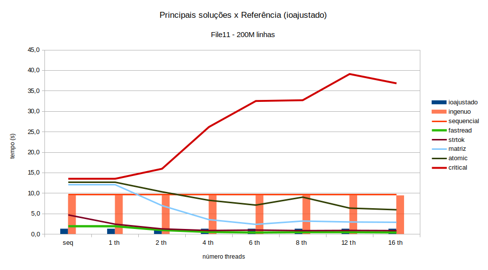

# Eleição Ursal - OpenMP

## Equipe
**Nome:** Flavio Vieira Leao **Matrícula:** 150125682  

**Nome:** João Pedro Soares Cirqueira **Matrícula:** 150132344 

**Nome:** Moacir Mascarenha Soares Junior **Matrícula:** 170080366

## Solução
  O objetivo deste trabalho é implementar o exercício Eleição [U.R.S.A.L](https://moj.naquadah.com.br/contests/bcr-PSPD-2021_1/eleicao-ursal) utilizando OpenMP para paralelizar o algoritimo, vizando diminuir o tempo de execução do projeto. A implementação sequencial, para solução do exercicio, foi utilizada como base para a elaboração da solução paralela com OpenMP. Após isso todas as tentativas da diminuição do tempo de execução estão disponíveis na pasta src.
  
  Inicialmente o arquivo é dividido em blocos de leitura, onde cada thread trabalha com a leitura dos dados de um determinado bloco. A partir desta etapa, várias estratégias foram utilizadas com o intuito de melhorar o tempo de leitura e contagem dos votos, sendo elas: 
  a utilização e vetores globais, utilização de vetores privados onde cada thread trabalha com o seu proprio vetor e posteriomente repassa aos vetores globais, e a utilização de uma matriz global onde cada thread trabalha em uma linha, evitando assim a concorrência entre as threads.

### Regiões críticas de paralelização
  O código possui sua area critica no momento da leitura dos dados de entrada, foi notório ao longo do desenvolvimento que a maior parte do tempo de execução é gasta na leitura. O grupo buscou utilizar a paralelização neste bloco de leitura tendo em vista a grande diferença do tempo de execução neste bloco. Utilizando uma thread, o tempo de execução é poucos segundos maior que a versão sequencial. Com o aumento das threads a leitura passa a ter melhor desempenho, diminuindo o tempo em mais da metade, comparado ao sequencial.

  
### Tabelas e Gráficos

#### Tebela dados dos arquivos.

| | 	Nr linhas| Tamanho [B]| Tamanho [kB]| 
| :--- | :---| :---| :---|
| file001 |        21| 	       98| 	      0,10| 
| file009 |        26| 	      119| 	      0,12| 
| file002 |        51| 	      231| 	      0,23| 
| file003 |       256| 	     1151| 	      1,12| 
| file004 |      1371| 	     6144| 	      6,00| 
| file005	|     10296|      46020| 	     44,94| 
| file006 |    100171| 	   447148| 	    436,67| 
| file007 |   1000491| 	  4489715| 	  4.384,49| 
| file008 |  10000176| 	 44891323|   43.839,18| 
| file010 |  50000001| 	224449797| 	219.189,25| 
| file011 | 200000001| 	897799152| 	876.756,98| 


#### Melhor solução da equipe
   A tabela e gráfico abaixo exibem as comparações entre a melhor solução desenvolvida pelo grupo(eleicao-ursal-fastread.c) com a solução sequencial, desenvolvida pelo Flávio, e com as soluções disponibilizadas pelo professor(ribas-ac-ingenuo e ribas-ac-ioajustado).


#### Tebela e grafico com os tempos em milesegundos.

|        |file01 |file02  |file03  |file04  |file05  |file06  |file07  |file8  |file09  |file10  |file11 | 
|:---:|:---:|:---:|:---:|:---:|:---:|:---:|:---:|:---:|:---:|:---:|:---:|
| ioajustado  |14	|15	|16	|18	|27	|15	|22	|81	 |14	|335	|1283 |
| ingenuo     |16	|13	|12	|14	|14	|22	|61	|491 |14	|2390	|9419 |
| sequencial  |16	|19	|21	|17	|17	|23	|67	|503 |16	|2421	|9715 |
| 1 threads   |18	|20	|37	|20	|22	|24	|31	|99	 |22	|493	|1927 |
| 2 threads   |17	|17	|19	|18	|17	|20	|26	|68	 |16	|281	|1003 |
| 4 threads   |22	|20	|18	|21	|22	|21	|22	|48	 |18	|152	|545  |
| 6 threads   |19	|20	|20	|21	|21	|21	|25	|45	 |18	|173	|346  |
| 8 threads   |17	|25	|22	|26	|20	|23	|26	|49	 |18	|148	|470  |
|12 threads   |24	|30	|34	|27	|35	|31	|37	|43	 |33	|129	|410  |
|16 threads   |25	|24	|24	|27	|19	|22	|31	|46	 |20	|127	|424  |

Melhor solução eleicao-ursal-fastread.c

<p align="center">  </p>
<p align="center">  </p>
<p align="center">  </p>
<p align="center">  </p>


#### Comparação de soluções antigas da equipe

  A tabela e o grafico abaixo, exibem dados de algumas soluções desenvolvidas pela equipe, utilizando 16 threads.
#### Comparação de soluções antigas da equipe
  A tabela e gráfico abaixo exibem as comparações entre a melhor solução desenvolvida pelo grupo(eleição-ursal-fastread) com outras soluções antigas desenvolvidas pelo grupo (strtok, matriz, atomic, critical), e com as soluções disponibilizadas pelo professor(ribas-ac-ingenuo e ribas-ac-ioajustado).


|        |ioajustado |ingenuo |sequencial  |fastread  |strtok  |matriz  |atomic  |critical  | 
|:---:|:---:|:---:|:---:|:---:|:---:|:---:|:---:|:---:|
|    serial   | 1,28 | 9,42 |	9,72 | ----  | ----  |	----  |	----  |	----   |
| 1 threads   | ---  | ---  | ---  |	1,93 |	2,45 |	12,07	| 12,75 |	13,54  |
| 2 threads   | ---  | ---  | ---  |	1,00 |	1,29 |	6,98  |	10,35 |	15,98  |
| 4 threads   | ---  | ---  | ---  |	0,55 |	0,90 |	3,56  |	8,27  |	26,19  |
| 6 threads   | ---  | ---  | ---  |	0,34 |	1,01 |	2,41  |	7,11  |	32,53  |
| 8 threads   | ---  | ---  | ---  |	0,47 |	0,87 |	3,21  |	9,05  |	32,73  |
|12 threads   | ---  | ---  | ---  |	0,41 |	0,92 |	2,99  |	6,37  |	39,12  |
|16 threads   | ---  | ---  | ---  |	0,42 |	0,87 |	2,91  |	5,97  |	36,85  |

Arquivo file11

<p align="center">  </p>

#### Link apresentação  

<p align="left">  </p>

https://www.canva.com/design/DAEss4rM_4c/xNgnYX2ocNzcf3DFcF-y_Q/view?utm_content=DAEss4rM_4c&utm_campaign=designshare&utm_medium=link&utm_source=sharebutton

#### Como rodar  

```$ gcc eleicao_ursal_final.c ursal.c -o eleicao -fopenmp```

```$ ./eleicao [arquivo_entrada] [quantidade_threads]```  


#### Especificações de ambiente de execução
**SO**: Ubuntu 20.04.03
**Memoria RAM**: 16 GB

**Processador**
Architecture:                    x86_64

CPU op-mode(s):                  32-bit, 64-bit

Address sizes:                   39 bits physical, 48 bits 

CPU(s):                          12

On-line CPU(s) list:             0-11

Thread(s) per core:              2

CPU family:                      6

Model name:                      Intel(R) Core(TM) i7-8700 CPU @ 3.20GHz


