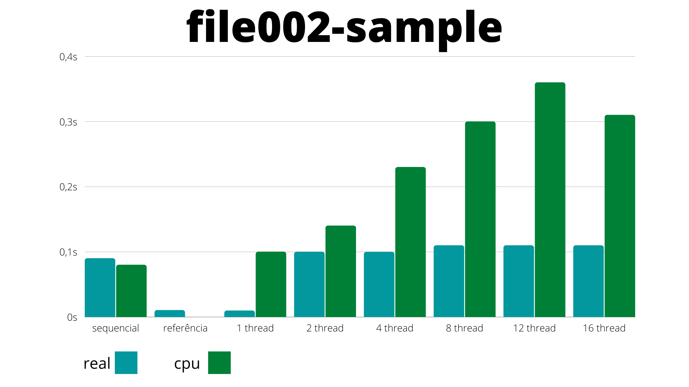
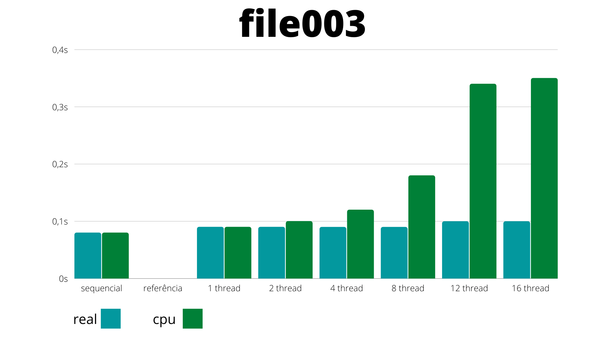
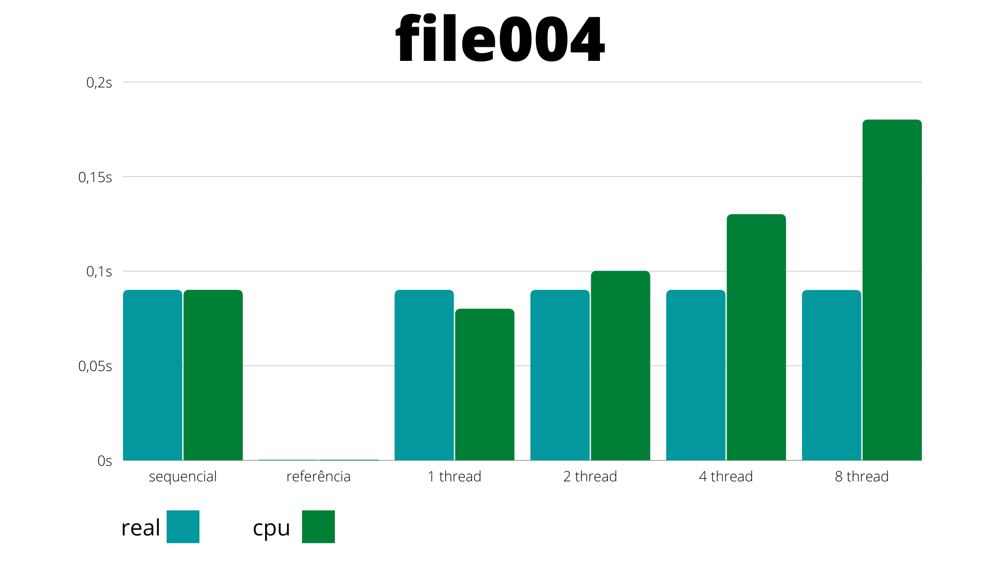
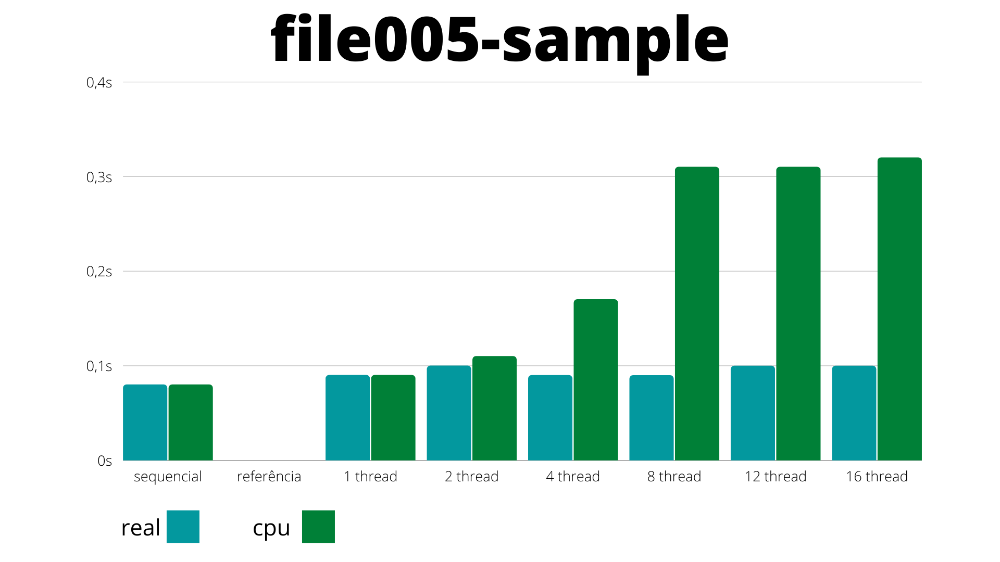
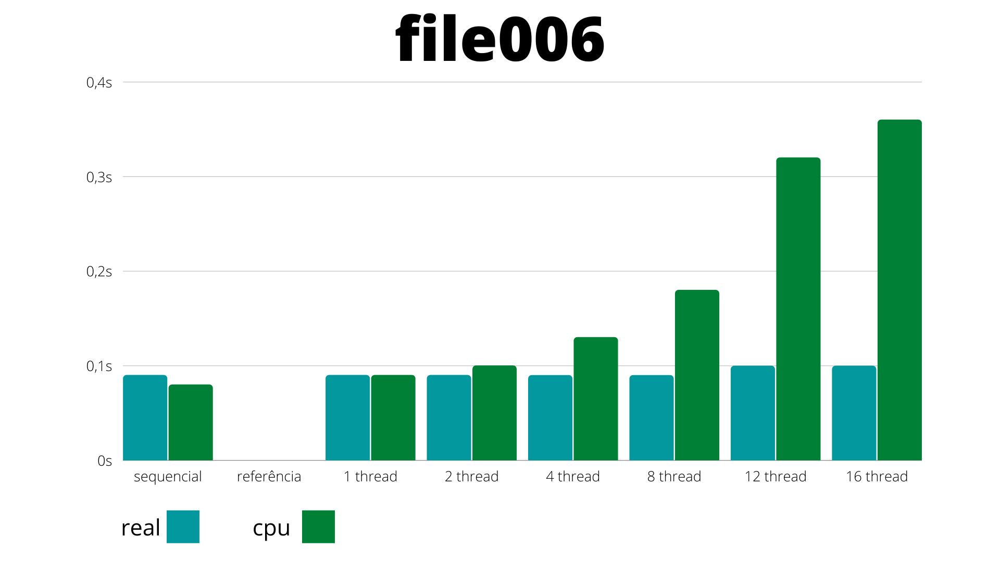
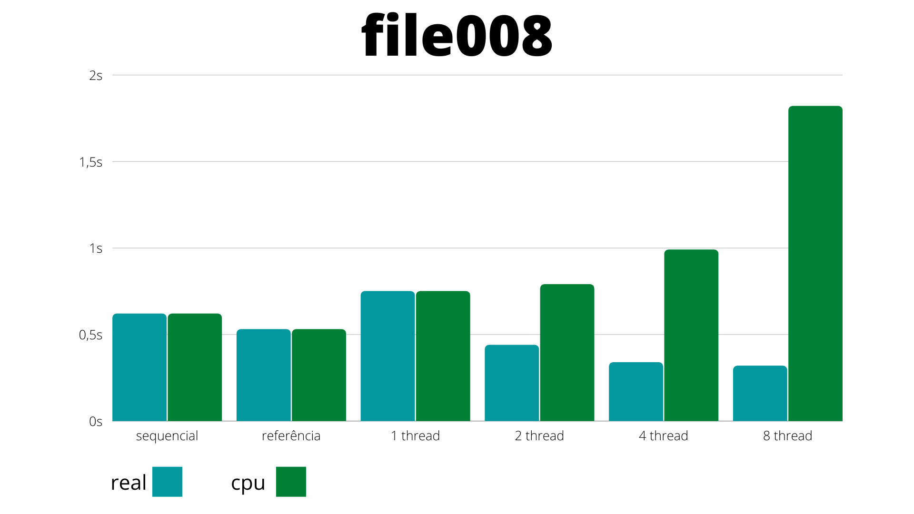
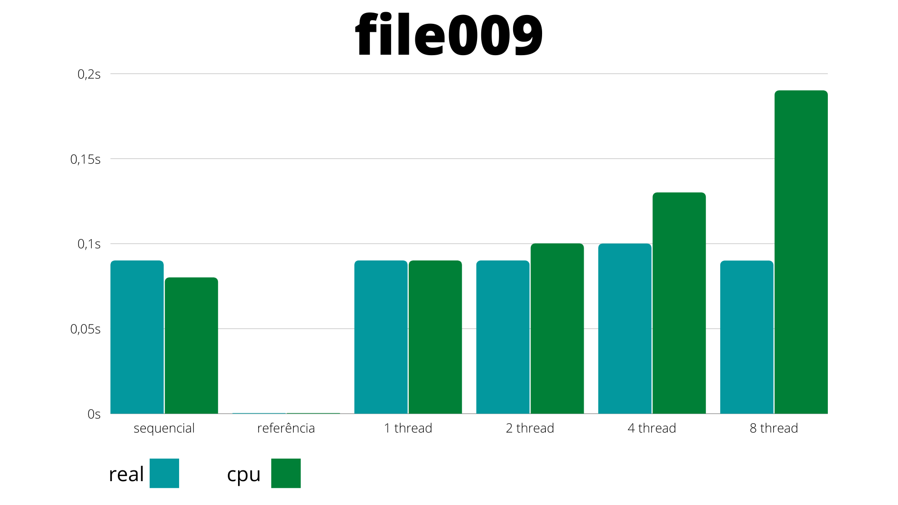
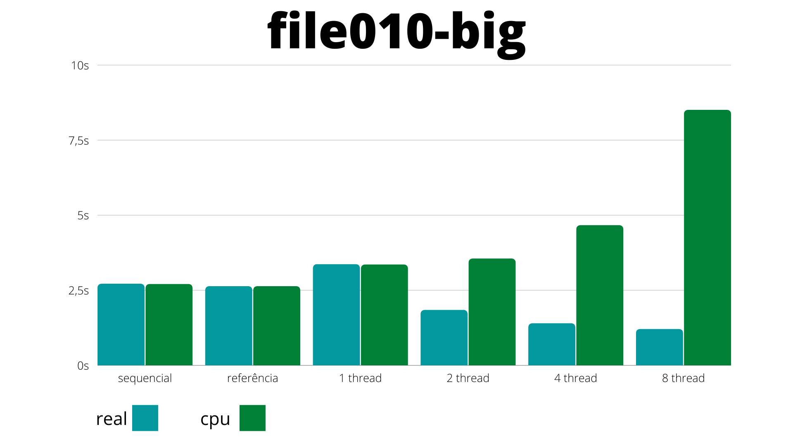
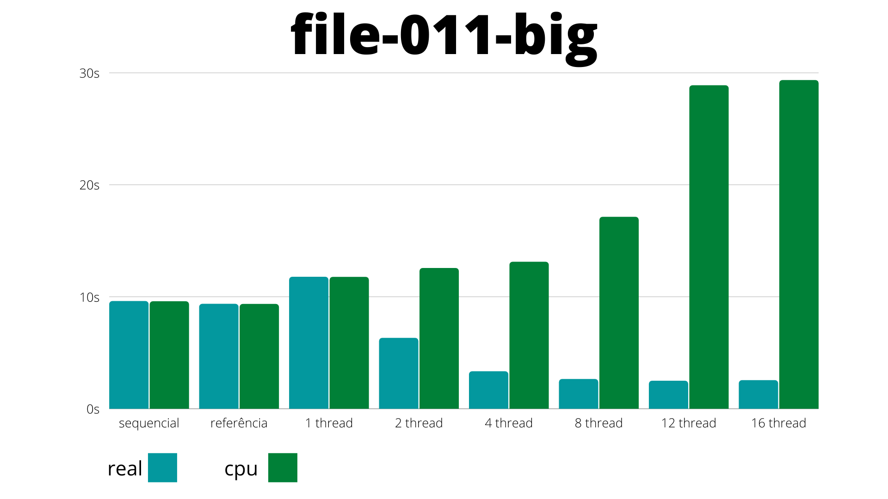

# Relatório - Trabalho 01
## Programação para Sistemas Paralelos e Distribuídos

| Estudante | Matrícula |
| :-: | :-: |
| Murilo Loiola Dantas | 17/0163571 |
| Victor Amaral Cerqueira | 17/0164411 |

## 1. Introdução
O objetivo do trabalho é o estudo e análise das regiões críticas do código para a implementação de paralelização utilizando a ferramenta OpenMP. Para a realização do estudo foi dado um problema simples de lógica de programação, o sistema CHOCOCINO (para os testes com mais threads) e a ferramenta OpenMP para a construção das threads.

## 2. Regiões críticas de paralelização
Com o código base sequencial produzido, foi estudado no código onde poderíamos adicionar as threads para otimização do código. As regiões mais relevantes para paralelização foram:
- Ordenação (merge sort);
- Cálculo final da matriz;
- Leitura dos dados do arquivo.

### 2.1. Ordenação
Como foi discutido e implementado em sala, o ganho de tempo de processamento quando feita a paralelização da ordenação não é tão relevante. Ainda assim, realizamos os testes de tempo e verificamos que realmente não era necessário.

Tempo gasto para execução: 0.13 segundos com ganhos de ~.02 segundos paralelizado

### 2.2. Cálculo final da matriz
A matriz utilizada para evitar concorrência de acesso na leitura do arquivo precisa ter seus valores consolidados após o término da leitura. Como a matriz possui 16 linhas e 100.000 colunas, foi utilizado um laço dentro de laço com 1.600.000 ciclos. Apesar disso, o corpo de execução do laço é composto por somente uma atribuição de valor e uma operação de aritmética simples. Verificando o tempo gasto para a execução dessa parte, notou-se que o ganho de paralelização não seria tão relevante.

Tempo gasto para execução: 0.05 segundos

### 2.3. Leitura dos dados do arquivo
A leitura dos dados do arquivo é o trecho de código que mais demanda tempo de processamento, principalmente para grandes entradas. Tendo isso em envidência, ela se tornou a principal região do código que necessitava da implementação das threads. 

## 3. Experimentos e tentativas
### 3.1. Sequencial
Como o problema de lógica para o estudo foi simples, a solução sequencial não teve nenhum problema em ser realizada.

### 3.2. Threads
Com a necessidade de paralelização do código e por nunca termos utilizado a ferramenta que era requisitada no estudo, acabamos tendo alguns problemas na hora de paralelizar o código base.

A primeira solução que aplicamos foi criar um vetor de struct para cada tipo de candidato (presidente, senador e deputados), cada um contendo o número e quantidade de votos dos candidatos. A paralelização ocorria na leitura das entradas do arquivo. Contudo, com essa solução, as threads acabavam entrando em conflitos de acesso, quando duas ou mais threads tentavam acessar o mesmo índice de um vetor simultaneamente.

A segunda solução foi criar uma matriz para os candidatos, onde cada thread operaria em uma única linha da matriz e os candidatos seriam identificados pelas colunas. Com a separação do processo entre threads e elas não podendo acessar um mesmo vetor, acabamos com os problemas de conflito e ganhamos tempo de processamento. A única desvantagem é o cálculo extra necessário após a leitura do arquivo, na consolidação dos resultados. O tempo gasto nessa etapa, no entanto, é rapidamente recompensado com o tempo ganho da paralelização em entradas maiores.

Para evitar outros conflitos de acesso, a variável 'voto' foi tornada privada de cada thread e foi aplicado um reduction nas variáveis de soma de votos.

## 4. Teste de desempenho
No dia no qual o grupo testou o projeto, a máquina CHOCOCINO recomendada pelo professor não estava disponível. Fomos orientados a usar uma máquina dos próprios integrantes do grupo, apesar da limitação de 8 threads.

### 4.1. Gráficos

#### 4.1.1 FILE001-SAMPLE

    

#### 4.1.2 FILE002-SAMPLE

    

#### 4.1.3 FILE003

    

#### 4.1.4 FILE004

    

#### 4.1.5 FILE005-SAMPLE

    

#### 4.1.6 FILE006

    

#### 4.1.7 FILE007-SAMPLE

    

#### 4.1.8 FILE008

    

#### 4.1.9 FILE009

    

#### 4.1.10 FILE010-BIG

    

#### 4.1.11 FILE-011-BIG

    

### 4.2. Conclusões

Cada programa foi executado 3 vezes com cada arquivo e os gráficos representam a média dos tempos de execução.

Os principais pontos a serem destacados são:

- Fazer uso de mais threads nos arquivos menores aumentou o tempo de processamento sem ganhos significantes no tempo de execução. Isso acontece por causa dos passos extras que a implementação das threads exige. Isso é facilmente notável comparando a execução sequencial e a execução com 1 thread. Apesar de ambos usarem somente uma thread para processamento, a execução com 1 thread perde ou empata com a sequencial em todos os casos.

- O ganho de tempo da execução com mais threads torna-se mais claro nos arquivos maiores. Nos arquivos 'big', por exemplo, a utilização de mais threads aumenta o tempo de processamento, devido a utilização do processador por completo, mas reduz significativamente o tempo de execução.

[Planilha com os tempos médios de execução](https://docs.google.com/spreadsheets/d/1oWU8GOvMt8J1LMZlms-_GB_e31vwBHyafCCxKyFT1iE/edit?usp=sharing)

Obs.: É possível mudar o número de threads a serem executadas na linha 44 do arquivo 'thread.c'.

Obs2.: O arquivo 'thread.c' deve ser compilado com a flag '-fopenmp', devido a utilização da biblioteca opm.h