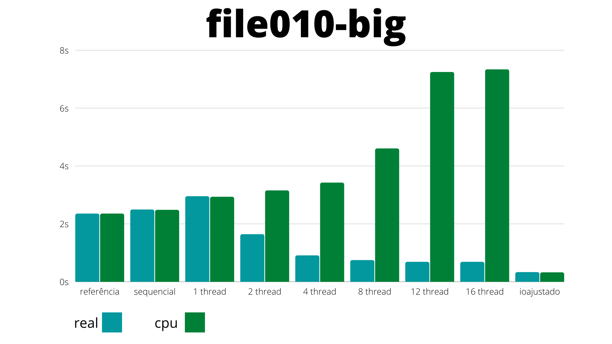
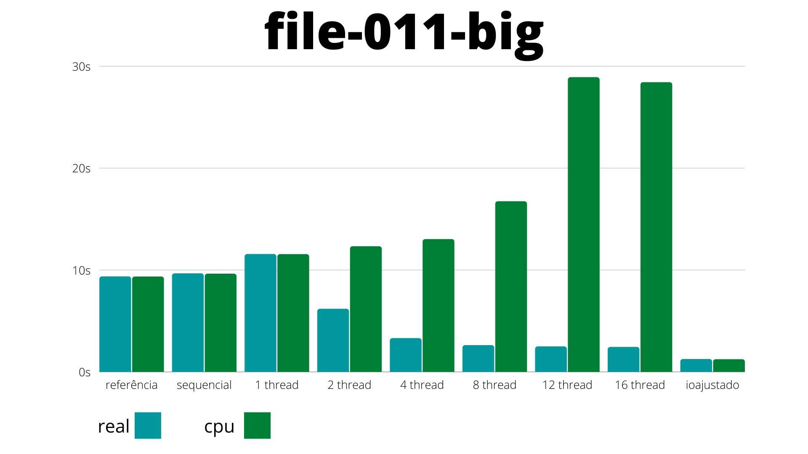
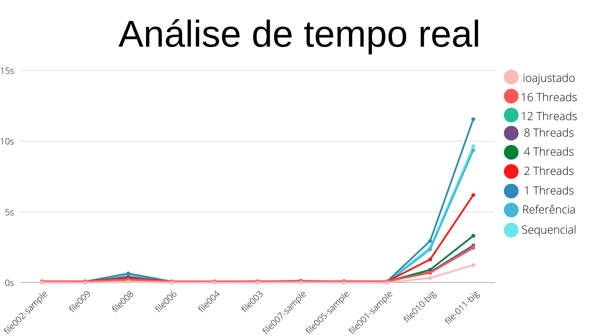
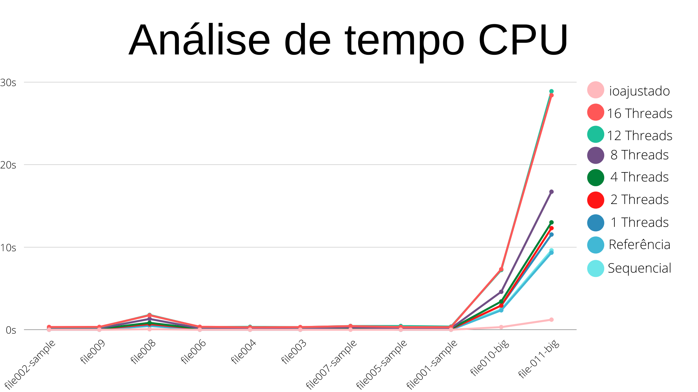

# Relatório - Trabalho 01
## Programação para Sistemas Paralelos e Distribuídos

| Estudante | Matrícula |
| :-: | :-: |
| Murilo Loiola Dantas | 17/0163571 |
| Victor Amaral Cerqueira | 17/0164411 |

## 1. Introdução
O objetivo do trabalho é o estudo e análise das regiões críticas do código para a implementação de paralelização utilizando a ferramenta OpenMP. 

Para a realização do estudo foi dado um problema simples de lógica de programação, o sistema CHOCOCINO (para padronização dos testes e para testes com mais threads) e a ferramenta OpenMP para a construção das threads.

## 2. Regiões críticas de paralelização
Com o código base sequencial produzido, foi estudado no código onde poderíamos adicionar as threads para otimização do código. As regiões mais relevantes para paralelização foram:
- Ordenação (merge sort);
- Cálculo final da matriz;
- Leitura dos dados do arquivo.

No entanto o único ponto em que se obteve ganhos significativos de tempo foi na leitura de arquivos, sendo evidenciado principalmente nos arquivos com grandes entradas (os BIG's).

Na versão final paralelizada foi feita a paralelização da leitura do arquivo de entradas, onde cada thread fica responsável por computar uma parte do arquivo. Para determinar quanto cada thread terá que ler do arquivo, utilizamos o tamanho total do arquivo e dividimos em chunk's semelhantes de acordo com o número de threads. Por exemplo, caso o programa execute com 2 thread's o arquivo seria dividido em 2 partes iguais, 3 thread's, em 3, e assim por diante. Assim é determinado quanto cada thread lê do arquivo. Um problema comum dessa divisão do arquivo em bytes de leitura é ocorrer de uma thread parar no meio de uma entrada (número de voto) e quebrar a leitura. Para evitar que isso ocorresse, cada ponteiro de leitura retrocede um caracter por vez até encontrar um "\n", determinando ali o começo da leitura.

## 3. Experimentos e tentativas
### 3.1. Sequencial
Como o problema de lógica para o estudo foi simples, a solução sequencial não teve nenhum problema em ser realizada. Como o esperado foi a solução menos eficiente e que demandou mais tempo de execução para as grandes entradas.

### 3.2. Threads
#### 3.2.1. Vetor candidatos
A primeira solução que aplicamos foi criar um vetor de struct para cada tipo de candidato (presidente, senador e deputados), cada um contendo o número e quantidade de votos dos candidatos.

A paralelização ocorria na leitura das entradas do arquivo, porém, com essa solução, as threads acabavam entrando em conflitos de acesso, quando duas ou mais threads tentavam acessar o mesmo índice de um vetor simultaneamente.

#### 3.2.2. Matriz
A segunda solução foi criar uma matriz [thread]x[Candidato], onde cada thread operaria em uma única linha da matriz e os candidatos seriam identificados pelas colunas e o numero de votos contabilizado pela thread seria alocado na posição correspondente da matriz. Após o cálculo de todas as thread's é feito um último cálculo para armazenar o valor contido em cada thread em um vetor final que será utilizado posteriormente para ordenação e cálculo dos candidatos eleitos. 

No trecho de código abaixo, é possível verificar que cada thread acessa somente a linha da matriz correspondente ao seu identificador (thread 1 acessa linha 1, por exemplo).

```c
#pragma omp parallel private(voto) reduction(+ \
                                             : votoInvalido, votoValido, votoPresidente)
    {
        FILE *inputFile = fopen(argv[1], "r");

        int currentThread = omp_get_thread_num();
        int currentPointer = threadStartingPoints[currentThread];
        int endPointer = threadStartingPoints[currentThread + 1];
        if (currentThread == nThreads - 1)
        {
            endPointer = endPosition;
        }

        fseek(inputFile, currentPointer, SEEK_SET);
        int size_read;

        while (fscanf(inputFile, "%d%n", &voto, &size_read) != EOF)
        {
            // Evita que uma thread invada o espaço de leitura da proxima
            currentPointer += size_read;
            if (currentPointer >= endPointer)
            {
                break;
            }

            if (voto < 10)
            {
                votoInvalido++;
            }
            else
            {
                results[currentThread][voto].nCandidato = voto;
                results[currentThread][voto].qtdVotos += 1;
                votoValido++;
                if (voto < 100)
                    votoPresidente++;
            }
        }
    }
```

Com a separação do processo entre threads e elas não podendo acessar um mesmo vetor, acabamos com os problemas de conflito e ganhamos tempo de processamento. 

A única desvantagem é o cálculo extra necessário após a leitura do arquivo, na consolidação dos resultados. O tempo gasto nessa etapa, no entanto, é rapidamente compensado com o tempo ganho da paralelização em entradas maiores.

Para evitar outros conflitos de acesso, a variável 'voto' foi tornada privada de cada thread e foi aplicado um reduction nas variáveis de soma de votos.

## 4. Teste de desempenho
Todos os testes foram realizados na máquina CHOCOCINO disponibilizada pelo professor.
Especificações: Intel(R) Core(TM) i7-8700 CPU @ 3.20GHz 6 cores, 16GB

## 4.1. Tempos computados (ARQUIVOS COMPILADOS COM A FLAG -O3)

Os valores a seguir são a média de 3 execuções na máquina descrita acima.

| file010-big | PROF-INGENUO | PROF-IOAJUSTADO | SEQUENCIAL | 1 THREAD | 2 THREADS | 4 THREADS | 8 THREADS | 12 THREADS | 16 THREADS |
| :---------: | :----------: | :------------:  | :--------: | :------: | :-------: | :-------: | :-------: | :--------: | :--------: |
| REAL        | 2,35         | 0,33            | 2,49       | 2,95     | 1,64      | 0.91      | 0,75      | 0,69       | 0,69       | 
| USER        | 2,34         | 0,30            | 2,45       | 2,91     | 3,12      | 3,37      | 4,58      | 7,20       | 7,28       |
| SYS         | 0,01         | 0,02            | 0.03       | 0,02     | 0,03      | 0,05      | 0,02      | 0,04       | 0,04       |

| file-011-big| PROF-INGENUO | PROF-IOAJUSTADO | SEQUENCIAL | 1 THREAD | 2 THREADS | 4 THREADS | 8 THREADS | 12 THREADS | 16 THREADS  |
| :---------: | :----------: | :------------:  | :--------: | :------: | :-------: | :-------: | :-------: | :---------: | :--------: |
| REAL        | 9,35         | 1,24            | 9,65       | 11,55    | 6,19      | 3,31      | 2,63      | 2,50        |  2,45      |
| USER        | 9,26         | 1,14            | 9,57       | 11,45    | 12,22     | 12,9      | 16,71     | 28,79       | 28,28      |
| SYS         | 0,08         | 0,08            | 0,05       | 0,09     | 0,09      | 0,11      | 0,10      | 0,11        | 0,13       |

### 4.2. Gráficos

#### 4.2.10 FILE010-BIG
<p align="center">
    
</p>

#### 4.2.11 FILE-011-BIG
<p align="center">
    
</p>

#### 4.2.12 Tempo de CPU
<p align="center">
    
</p>

#### 4.2.12 Tempo Real
<p align="center">
    
</p>


### 5. Conclusão

Os principais pontos a serem destacados são:

- Fazer uso de mais threads nos arquivos menores aumentou o tempo de processamento sem ganhos significantes no tempo de execução. Isso acontece por causa dos passos extras que a implementação das threads exige. Isso é facilmente notável comparando a execução sequencial e a execução com 1 thread. Apesar de ambos usarem somente uma thread para processamento, a execução com 1 thread perde ou empata com a sequencial em todos os casos.

- O ganho de tempo da execução com mais threads torna-se mais claro nos arquivos maiores. Nos arquivos 'big', por exemplo, a utilização de mais threads aumenta o tempo de processamento, devido a utilização do processador por completo, mas reduz significativamente o tempo de execução.

- Os dois últimos gráficos tem uma estrutura semelhante, porém estão invertidos. É possível notar que, ao aumentar o número de threads, o tempo de uso de CPU também aumenta (utilização mais completa dos núcleos de processamento disponíveis) e, proporcionalmente, o tempo real diminui (quase todas as vezes).

[Planilha com os tempos médios de execução](https://docs.google.com/spreadsheets/d/1oWU8GOvMt8J1LMZlms-_GB_e31vwBHyafCCxKyFT1iE/edit?usp=sharing)

Obs.: É possível mudar o número de threads a serem executadas na linha 37 do arquivo 'thread.c'.

Obs2.: O arquivo 'thread.c' deve ser compilado com a flag '-fopenmp', devido a utilização da biblioteca opm.h